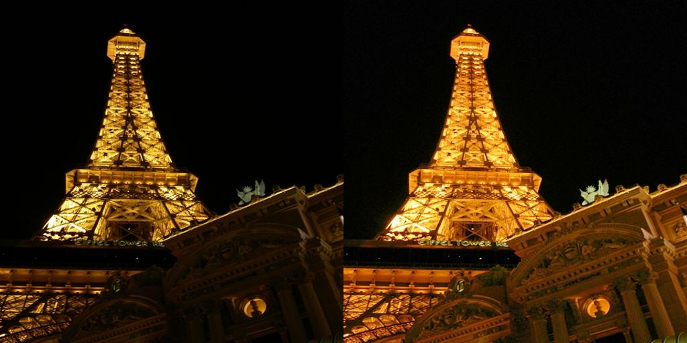
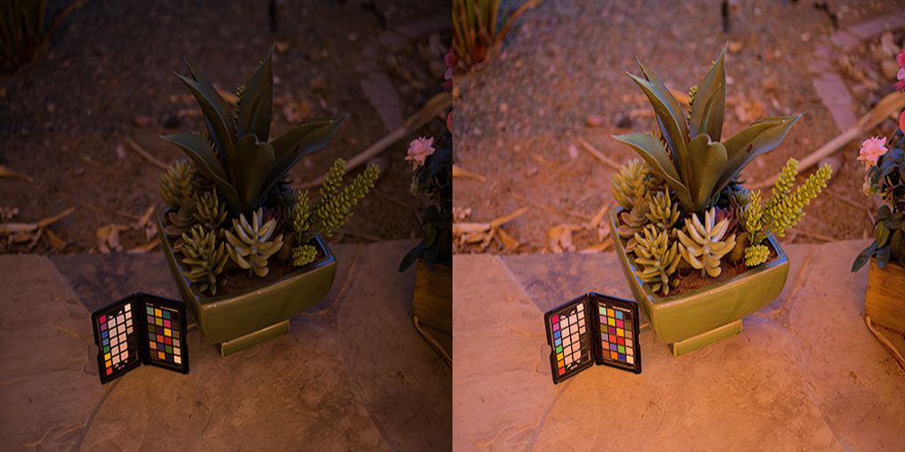
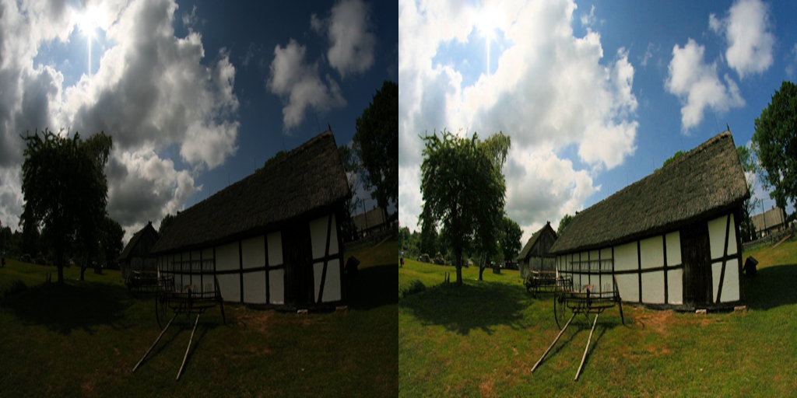
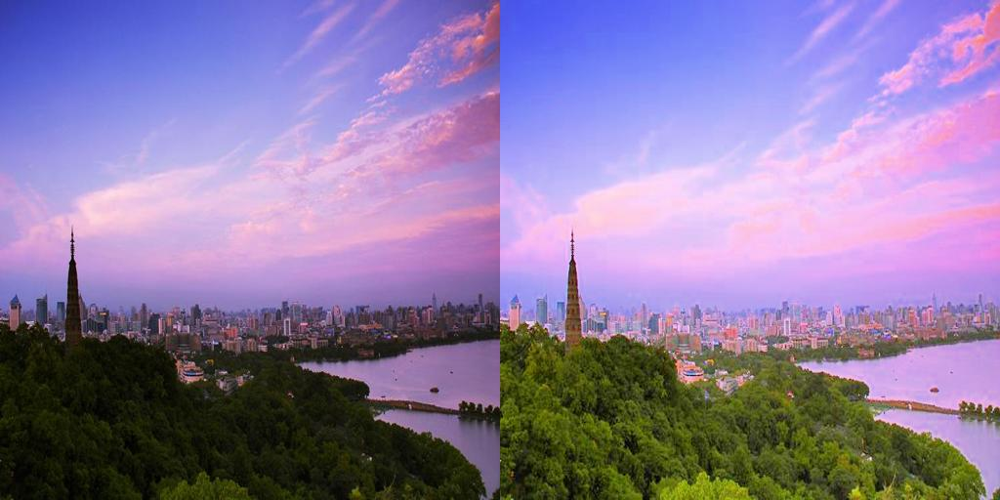

# Low-Light Image Enhancement Results

This repository presents results from my published research on low-light image enhancement.

📄 Paper:
https://link.springer.com/article/10.1007/s11554-025-01744-5

Published in *Journal of Real-Time Image Processing*.

## Results

### Side-by-Side Comparison (Dark → Enhanced)

